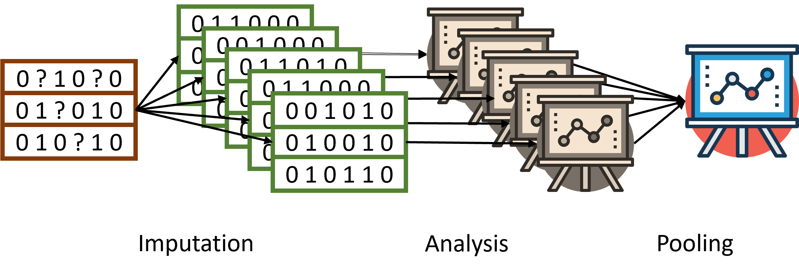

```{r setup, include = F}
knitr::opts_chunk$set(echo = FALSE, warning = FALSE, message = FALSE, comment = ">")

library(dmo)
library(ggplot2)
library(dplyr)
library(tidyr)
library(mice)
library(knitr)
library(kableExtra)
theme_set(theme_light())

```

# Missing data mechanisms (recap) {data-background=Puzzle_zgnb3.jpg data-background-size=cover}

## Assuming the missing data mechanism (MCAR) 

The methods to deal with missing data, implicitly assume a missing data mechanism. 

**MCAR**: the most strict assumption. In practice it is also easiest to deal with MCAR data. 

1. Analyze the observed sample only (this will result in unbiased estimates).
2. Use an imputation method to boost the power the the amount of missing data is too large. 


## Assuming the missing data mechanism (MAR) 

**MAR**: less strict assumption. Most advanced missing data methods assume this mechanism (e.g. multiple imputation, FIML). 

* Include variables in study that may explain the missing data, a MAR assumption may become more plausible (as compared to MNAR). 
* These auxiliary variables may also help in dealing with the missing data. 
* **Auxiliary variables**: variables related to the probability of missing data or to the variable with missing data. 
  + Can be used as predictors in an imputation model or as covariates in a FIML model to improve estimations.


## Assuming the missing data mechanism (MNAR) 

**MNAR**: least strict assumption. 

* MNAR data are also referred to as non-ignorable, because these cannot be ignored without causing bias in results. MNAR data are more challenging to deal with. 


# Ad hoc missing data methods {data-background=Puzzle_zgnb3.jpg data-background-size=cover}

## Complete-case analysis {.build}

**Complete-case analysis (CCA)**: only the cases with observed data for all variables involved are used in the analysis. 

* The most common and easy way to deal with missing data. 
* The default method for many data analysis procedures. 
* Assumes MCAR

**Parameter estimates**:

* Mean is unbiased for MCAR
* Regression weight/correlation unbiased for MCAR
* Standard errors are overestimated


## CCA {.smaller} 

```{R echo=FALSE, fig.height = 4, fig.align='center'}
set.seed(7869)
x <- MASS::mvrnorm(n=100,mu=c(0,0,0), Sigma=matrix(c(5,1,1,1,5,1,1,1,5),3,3)) %>% 
  data.frame() 
set.seed(8965)
mcar <- MCAR(x, alpha = 0.5, pattern = matrix(c(0,1,1), nrow = 1))

fitx <- lm(X1 ~ X2, data = x) %>% tidy()
fitmcar <- lm(X1 ~ X2, data = mcar) %>% tidy()
show <- data.frame(bind_rows(round(fitx[2,c(2,3,5)],2),
                     round(fitmcar[2,c(2,3,5)],2)))
rownames(show) <- c("Complete", "MCAR")
show %>% kable(caption = "MCAR | regression") %>% kable_styling(full_width = FALSE, position = "left")

ggplot()+
  geom_point(data = x, aes(X2, X1), color = "#F8766D") +
  geom_smooth(data = x, aes(X2, X1), color = "#00BFC4", method = "lm", se = F)+
  geom_point(data = mcar, aes(X2, X1), color = "#00BFC4") +
  geom_smooth(data = mcar, aes(X2, X1), color = "#F8766D", method = "lm", se = F)


#blue: 00BFC4
#red: F8766D
```

## CCA {.smaller}


```{R echo=FALSE, fig.height = 4, fig.align='center'}
set.seed(7869)
x <- MASS::mvrnorm(n=100,mu=c(0,0,0), Sigma=matrix(c(5,1,1,1,5,1,1,1,5),3,3)) %>% 
  data.frame() 
set.seed(8965)
mar <- MAR(x, alpha = 0.5, pattern = matrix(c(0,1,1), nrow = 1))

fitx <- lm(X1 ~ X2, data = x) %>% tidy()
fitmar <- lm(X1 ~ X2, data = mar) %>% tidy()
show <- data.frame(bind_rows(round(fitx[2,c(2,3,5)],2),
                     round(fitmar[2,c(2,3,5)],2)))
rownames(show) <- c("Complete", "MAR")
show %>% kable(caption = "MAR | regression") %>% 
  kable_styling(full_width = FALSE, position = "left")

ggplot()+
  geom_point(data = x, aes(X2, X1), color = "#F8766D") +
  geom_smooth(data = x, aes(X2, X1), color = "#00BFC4", method = "lm", se = F)+
  geom_point(data = mar, aes(X2, X1), color = "#00BFC4") +
  geom_smooth(data = mar, aes(X2, X1), color = "#F8766D", method = "lm", se = F)


#blue: 00BFC4
#red: F8766D
```

## Imputation {.build}

**Imputation:** replacing the missing with a value. 

*Possible values to impute?*

* Mean
* Regression estimate
* Random value
* Previous observation (longitudinal study)
* Informed guess / estimate
* ...

## Assumption of *single* imputation

* **Most important:** assumes that the imputed value is an actual observed value.
* Some assume MCAR (i.e. regression imputation, random value imputation)

Other examples:

* All missing values are average (i.e. mean imputation)
* People with missing data remain stable (i.e. LOCF)

## Example data {.smaller}

```{r echo=FALSE, fig.height = 4, fig.align='center'}
dmo::perform %>% group_by(gender) %>% summarise(n = n(),
                                           "wgt n" = sum(!is.na(weight)),
                                           "wgt mean" = mean(weight, na.rm = TRUE),
                                           "wgt sd" = sd(weight, na.rm = TRUE),
                                           "prf n" =sum(!is.na(performance)),
                                           "prf mean" = mean(performance, na.rm = TRUE), 
                                           "prf sd" = sd(performance, na.rm = TRUE)) %>%
  kable(digits = 3,
        col.names = c("Gender", "n", "n", "mean", "sd", "n", "mean","sd")) %>% 
  kable_styling(full_width = FALSE, position = "left") %>%
  add_header_above(c(" " = 2, "Weight" = 3, "Performance" = 3))

ggplot(dmo::perform) +
  geom_point(aes(x = weight, y = performance, group = gender, color = gender))+
  scale_colour_manual(values=c("dodgerblue", "hotpink"))

```

## Mean imputation 

* Imputing the average value for all missing entries
* Very easy method

**Parameter estimates**:

* Mean is unbiased when MCAR
* Regression weight/correlation never unbiased
* Standard errors are underestimated

## Mean imputation | Example

```{r, echo = F}
Rperf <- 1 - is.na(perform$performance)*1
imp_mean <- mice(perform, m = 1, method = "mean", print = F)

id_mn <- bind_cols(complete(imp_mean), Rperf = Rperf)

ggplot(id_mn, aes(weight, performance, color = factor(Rperf), group = factor(Rperf)))+
  geom_point(size = 2)+
  theme(legend.position = "none")

```

## Regression imputation

**Conditional mean imputation**: estimate the imputed value as a predicted value from a regression model:
$Y_{imp} = \beta_0 + \beta_1 * X$


**Parameter estimates**: 

* Mean is unbiased when MAR
* Regression weight is unbiased when MAR
* Correlation is never unbiased
* Standard errors are underestimated


## Regression imputation | Example {.smaller}

Imputation from regression equation: $Performance = \beta_0 + \beta_1 * weight + \beta_2 * gender$

```{r echo=FALSE}
imp_reg <- mice(perform, m = 1, method = "norm.predict", print = F)

id_rg <- bind_cols(complete(imp_reg), Rperf = Rperf)


ggplot(data = perform, aes(weight, performance, group = gender))+
  geom_point(size = 1)+
  geom_smooth(method = "lm", se = FALSE, color = "grey") +
  geom_point(data = id_rg, aes(weight, performance, color = factor(Rperf), group = gender))+
  theme(legend.position = "none")

``` 


## Regression imputation + sampling error {.smaller .build}

<!--
https://statisticsglobe.com/regression-imputation-stochastic-vs-deterministic/
-->
**Stochastic regressions**: regression imputation, with additional sampling error added to the predicted value:

* $Y_{imp} = \beta_0 + \beta_1 * X + \epsilon$

Sampling error is normally distributed.

**Parameter estimates**:

* Mean is unbiased when MAR
* Regression weight is unbiased when MAR
* Correlation is unbiased when MAR
* Standard errors are underestimated

*Imputation uncertainty is not taken into account*

## Regression imputation + residual error | Example {.smaller}

Imputation from regression equation: $Performance = \beta_0 + \beta_1 * weight + \beta_2 * gender + \epsilon$


```{r echo=FALSE}
imp_reg <- mice(perform, m = 1, method = "norm.nob", print = F)

id_rg <- bind_cols(complete(imp_reg), Rperf = Rperf)


ggplot(data = perform, aes(weight, performance, group = gender))+
  geom_point(size = 1)+
  geom_smooth(method = "lm", se = FALSE, color = "grey") +
  geom_point(data = id_rg, aes(weight, performance, color = factor(Rperf), group = gender))+
  theme(legend.position = "none")

``` 


## Last observation carried forward

Ad hoc method for longitudinal data: use the previous observed value to impute the missing values.

* Assumes that people that drop out of the study remain stable.


**Parameter estimates**:

* Mean is biased
* Regression is biased
* Correlation is biased
* Standard errors are underestimated


## Example longitudinal data {.smaller}

* A RCT for a weight loss intervention. 
* Measurements at baseline, mid-treatment (3m), post-treatment (6m), and two follow-up moments (12m and 24m).
* Missing data occurs at the measurements after the baseline, due to study drop-out.

```{R echo=FALSE}

mice::md.pattern(dmo::weightloss %>% pivot_wider(id_cols = c(id, group), names_from = month, values_from = weight))

```


## LOCF | Example imputed

The trajectories over time, with LOCF imputations in red.

```{r}
WL_R <- 1-is.na(weightloss$weight)
wl <- weightloss %>%
  mutate(Rwl = ifelse(is.na(weight), 0, 1)) %>%
  group_by(id) %>%
  mutate(Rid = ifelse(any(is.na(weight)), 0, 1))

wl_imp <- tidyr::fill(wl, weight)

ggplot(wl_imp, aes(month, weight, group = id, color = factor(Rwl)))+
  geom_line() +
  geom_point() +
  theme(legend.position = "none")+
  facet_wrap(.~group, nrow = 2)
```

## LOCF | Example imputed

Below only the cases with missing observations, separated by group.

```{R}
ggplot(wl_imp %>% filter(Rid == 0), aes(month, weight, group = id, color = factor(Rwl)))+
  geom_line() +
  geom_point() +
   theme(legend.position = "none")+
 facet_wrap(.~group, nrow = 2)

```


# Multiple imputation {data-background=Puzzle_zgnb3.jpg data-background-size=cover}

## Multiple imputation idea

* Imputing the missing data entries with multiple "plausible" values.
* Takes imputation uncertainty into account
* A method to improve the main **analysis results**, *so having a fully observed data set is not the goal*.
  + Unbiased estimates
  + More precision and thus power
* R package: `mice`
  

## Multiple Imputation process

* Imputation phase
* Analysis phase
* Pooling phase

> 1. Incomplete data
> 2. Generate multiple copies of the same dataset, but each time differenty imputed values
> 3. Analyze each imputed dataset
> 4. Pool results for analyses to final study result

## Multiple Imputation process

<br>
<center></center>


## Imputation phase

* Imputing the missing data entries with multiple "plausible" values
* Specify the **imputation model** 
  + method to estimate imputed values
  + predictors used in the model
  + *can both be specified for each variable with missing data*
  

## Algorithm for imputations

Fully Conditional Specification (FCS): imputes variable-by-variable.

* For each variable the imputation model can be different:
  + method
  + predictors
* Flexible method and allows imputations close to the data

Joint modelling: imputes from a multivariate distribution.

* Computationally less intensive.
* Good theoretical unterpinnings, provided that the model fits well with the data.


`mice` uses FCS


## General method FCS

Per variable with missing data:

* Impute missing value by using the predicted value estimated from observed data.
* Add residual error to simulate sampling error
* Depending on the variable type that needs to be imputed, the imputation method is defined.

> Later more on methods


## Predictors for imputation

Imputation model = method + predictors

* For each variable, the most relevant *predictors* can be indicated
* Use variables that are in the analysis model also in the imputation model (compatibility)
* Add *auxiliary variables* 
* Advice to use no more than 25 predictors (also depends on sample size)

*Auxiliary variables*: variables related to the probability of missing data or to the variable with missing data.


## Iterations

* One iteration = one cycle through all variables that need to be imputed. 
  + The algorithm starts with a random draw from the observed data.
  + Then imputes the incomplete data in a variable-by-variable fashion.
* Typically 5 to 10 iterations before an imputed data set is generated.
* Iterations are repeated to ensure convergence of the algorithm


## Iterations for data set 1 

**Iterations for generating the imputations for *Solar.R* in the first data set:**

```{r echo=FALSE}
set.seed(7876)
imp1 <- mice(airquality, maxit = 10, print = F, m = 1)
plot(imp1, y = "Solar.R", layout = c(1,1))[1]

```

## Iterations for data set 2

**Iterations for generating the imputations for *Solar.R* in the second data set:**

```{r, echo = FALSE}
set.seed(462)
imp2 <- mice(airquality, maxit = 10, print = F, m = 1)
plot(imp2, y = "Solar.R", layout = c(1,1))[1]

```

## Iterations for 5 imputed datasets

**Iterations for generating the imputations for *Solar.R* in all five data sets:**

```{r echo = FALSE}
set.seed(462)
imp2 <- mice(airquality, maxit = 10, print = F, m = 5)
plot(imp2, y = "Solar.R", layout = c(1,1))[1]

```


## Convergence check | airquality illustration {.smaller}


* Check the convergence of the algorithm for all imputed variables

```{r}
imp <- mice(airquality, maxit = 10, print = F)
plot(imp)

```

## Convergence check | airquality illustration {.smaller}

* Use additional iterations when in doubt if convergence is reached

```{r}
imp <- mice(airquality, maxit = 25, print = F)
plot(imp)

```


## Convergence check | boys illustration {.smaller}

* Convergence may need more iterations

```{r, cache = T}
imp <- mice(boys, print = F)
plot(imp, c("wgt", "gen", "tv"))

```

## Convergence check | boys illustration {.smaller}

* Looks better for gen and tv, but there seems to be a problem for wgt. 

```{r, cache = T}
imp <- mice(boys, maxit = 25, print = F)
plot(imp, c("wgt", "gen", "tv"))

```

## Adapting imputation model

* Changes in imputation model may be needed when:
  + Two variables are highly correlated (multi-collinearity)
  + A variable with so many missing values that the imputations are unstable


## Number of imputations

* Theoretically, higher $m$ is better. 
* Usually, use $m = 5$ for model building and $m$ *~ % missing data* for final analysis. 
* In lower $m$ the between-imputation-variance is enlarged by $\frac{1}{m}$ before computing the total variance.


## Analysis phase

* Each imputed data set is analyzed, with the substantive analysis model
* This results in $m$ sets of results

* Workflow:
  + Imputation
  + **Analysis**
  + Pooling

## Analysis example {.smaller}

```{r}
imp_pmm <- mice(airquality, method = "pmm", print = F)
fit <- with(imp_pmm, lm(Ozone ~ Solar.R))

summary(fit)

```

## Pooling phase

* Pool the analysis results to obtain final parameter estimates.
* For normally distributed parameters: **Rubin's Rules**

## Rubin's Rules

* Pooling of point estimates that are normally distributed over the imputed datasets. 
* Means, standard deviations, regression estimates, linear predictors, proportions.
* For pooling point estimates, use mean:

  > $\hat\theta = \frac{1}{m} \sum^m_{i=1}{\theta_i}$

* Pooling of variance or standard error around the estimate: combine the within and between imputation variance.

## Variance pooling Rubins Rules


Between variance:

> $\sigma^2_{between} = \frac{\sum^m_{i=1}(\beta_i - \overline\beta)^2}{m-1}$

<br>

Within variance:

> $\sigma^2_{within} = \frac{\sum^m_{i=1}\sigma^2_i}{m}$

<br>

**Total variance:** 

> $\sigma^2_{total} = \sigma^2_{within} + \sigma^2_{between} + \frac{\sigma^2_{between}}{m}$


## Pooling of non-normal parameters

* Use a transformation to approximate a normal distribution
* Examples:
  + Correlation: Fisher $z$
  + Odds Ratio, Relative Risk, Hazard ratio: log transformation
  + Explained variance: Fisher $z$ for $\sqrt{R^2}$
  
  

## Pooling example {.smaller}

```{r}
imp_pmm <- mice(airquality, method = "pmm", print = F)
fit_mi <- with(imp_pmm, lm(Ozone ~ Solar.R))

pool(fit_mi)
```

## Pool output

* **riv**: Relative increase in variance due to nonresponse
* **df**: Residual degrees of freedom for hypothesis testing
* **lambda**: Proportion of total variance due to missingness
* **fmi**: Fraction of missing information for the parameter estimates


# Imputation methods {data-background=Puzzle_zgnb3.jpg data-background-size=cover}


## Multiple imputation process

<center></center>
<br>

In the imputation phase, imputed values are estimated using an *imputation method*.

## Methods for continuous variables

* Regression imputation: `norm.predict`
* Stochastic regression imputation (regression + residual error): `norm.nob`
* Stochastic regression with parameter uncertainty: `norm`
* Predictive mean matching: `pmm`


## Example data | airquality {.smaller}

```{r echo = FALSE}
psych::describe(airquality) %>%
  kable() %>%
  kable_styling()
```

## Regression imputation | Algorithm

* Imputed value: $Y_{imp} = \hat{\beta}_0 + X_{mis}\hat{\beta}_1 + \epsilon$

* Parameters $\hat{\beta}_0$ and $\hat{\beta}_1$ are estimated from the observed data.

* *And updated after the first imputation with the imputed data.*

## Regression imputation | Concept

```{r echo=FALSE}
set.seed(7899)
dat1 <- data.frame(MASS::mvrnorm(n = 50, mu = c(0,0), Sigma = matrix(c(1, 0.75,  0.75, 1),2,2)))
dat <- dat1
dat[10,"X2"] <- NA

imp_reg1 <- mice(dat, method = "norm.predict", printFlag = FALSE)
#xyplot(imp_reg1, X2 ~ X1)

impr_long <- complete(imp_reg1, action = "long", include = FALSE) %>% 
  mutate(R = ifelse(.id == 10, 0, 1))

ggplot(impr_long, aes(X1, X2, color = factor(R), group = factor(R)))+
  geom_smooth(method = "lm", se = FALSE)+
  geom_point(size = 2)+
  theme(legend.position = "none")

``` 

## Regression imputation | Univariate imputation {.smaller}

```{r fig.height=4.2}
imp_reg <- mice(airquality %>% select(Ozone, Solar.R), method = "norm.predict", print = F)
xyplot(imp_reg, Ozone ~ Solar.R)
```

## Regression imputation | Multivariate imputation {.smaller}

```{r fig.height=4.2}
imp_reg <- mice(airquality,  method = "norm.predict", print = F)
xyplot(imp_reg, Ozone ~ Solar.R)
```

## Stochastic regression imputation | Algorithm

* Imputed value: $Y_{imp} = \hat{\beta}_0 + X_{mis}\hat{\beta}_1 + \epsilon$

* Parameters $\hat{\beta}_0$ and $\hat{\beta}_1$ are estimated from the observed data.

* *And updated after the first imputation with the imputed data.*

* $\epsilon$ is normally distributed residual error


## Stochastic regression imputation | Concept 

```{r echo=FALSE}

imp_sreg1 <- mice(dat, method = "norm.nob", print = F)
#xyplot(imp_sreg1, X2 ~ X1)

impsr_long <- complete(imp_sreg1, action = "long", include = FALSE) %>% 
  mutate(R = ifelse(.id == 10, 0, 1))

ggplot(impsr_long, aes(X1, X2, color = factor(R), group = factor(R)))+
  geom_smooth(method = "lm", se = FALSE)+
  geom_point(size = 2)+
  theme(legend.position = "none")

``` 


## Stochastic regression imputation | Univariate {.smaller}

```{r fig.height=4.2}
imp_reg <- mice(airquality %>% select(Ozone, Solar.R), method = "norm.nob", print = F)
xyplot(imp_reg, Ozone ~ Solar.R)
```

## Stochastic regression imputation | Multivariate {.smaller}

```{r fig.height=4.2}
imp_reg <- mice(airquality, method = "norm.nob", print = F)
xyplot(imp_reg, Ozone ~ Solar.R)
```


## Bayesian regression imputation | Algorithm

* Imputed value: $Y_{imp} = \dot{\beta}_0 + X_{mis}\dot{\beta}_1 + \epsilon$

* Parameters $\dot{\beta}_0$ and $\dot{\beta}_1$ are drawn from their posterior distribution.

* $\epsilon$ is normally distributed residual error

## Bayesian regression imputation | Concept

```{r echo=FALSE}

imp_breg1 <- mice(dat, method = "norm", print = F)
#xyplot(imp_sreg1, X2 ~ X1)

impbr_long <- complete(imp_breg1, action = "long", include = FALSE) %>% 
  mutate(R = ifelse(.id == 10, 0, 1))

#lm(X2 ~ X1, dat)

ggplot(impbr_long, aes(X1, X2, color = factor(R), group = factor(R)))+
  geom_smooth(method = "lm", se = FALSE, color = "#00BFC4", size = 1)+
  geom_abline(intercept = 0.015, slope = 0.78, color = "#F8766D", size = 1)+
  geom_abline(intercept = 0.08, slope = 0.7, color = "#F8766D", size = 1)+
  geom_abline(intercept = 0.12, slope = 0.63, color = "#F8766D", size = 1)+
  geom_abline(intercept = -0.2, slope = 0.6, color = "#F8766D", size = 1)+
  geom_abline(intercept = -0.3, slope = 0.56, color = "#F8766D", size = 1)+
geom_point(size = 2)+
  theme(legend.position = "none")
#blue = #00BFC4
# red = F8766D
``` 


## Bayesian regression imputation | Univariate {.smaller}

```{r fig.height=4.2}
imp_breg <- mice(airquality %>% select(Ozone, Solar.R), method = "norm", print = F)
xyplot(imp_breg, Ozone ~ Solar.R)
```

## Bayesian regression imputation | Multivariate {.smaller}

```{r fig.height=4.2}
imp_breg <- mice(airquality, method = "norm", print = F)
xyplot(imp_breg, Ozone ~ Solar.R)
```

## Predictive mean matching | Algorithm

* Estimate the predicted value using Bayesian regression imputation
  + $Y_{imp} = \dot{\beta}_0 + X_{mis}\dot{\beta}_1 + \epsilon$
  + Parameters $\dot{\beta}_0$ and $\dot{\beta}_1$ are drawn from their posterior distribution.
  + $\epsilon$ is normally distributed residual error
* Select $k$ nearest neighbors to this predicted value from the observed data
* Randomly draw one donor to use as imputed value

## Predictive mean matching | Concept


```{r echo=FALSE}

imp_preg1 <- mice(dat, method = "pmm", printFlag = FALSE)
#xyplot(imp_sreg1, X2 ~ X1)

imppr_long <- complete(imp_preg1, action = "long", include = FALSE) %>% 
  mutate(R = ifelse(.id == 10, 0, 1))

#lm(X2 ~ X1, dat)

ggplot(imppr_long, aes(X1, X2))+
geom_smooth(method = "lm", se = FALSE, color = "#00BFC4",  size = 1)+
geom_point(size = 2, color = "#00BFC4")+
  theme(legend.position = "none") + 
  ggtitle("Observed data")
#blue = #00BFC4
# red = 
``` 


## Predictive mean matching | Concept


```{r echo=FALSE}

imp_preg1 <- mice(dat, method = "pmm", printFlag = FALSE)
#xyplot(imp_sreg1, X2 ~ X1)

imppr_long <- complete(imp_preg1, action = "long", include = FALSE) %>% 
  mutate(R = ifelse(.id == 10, 0, 1))

#lm(X2 ~ X1, dat)

ggplot(imppr_long, aes(X1, X2, color = factor(R), group = factor(R)))+
geom_smooth(method = "lm", se = FALSE)+
geom_point(size = 2)+
  theme(legend.position = "none")+ 
  ggtitle("Imputed missing values")
#blue = #00BFC4
# red = 
``` 


## Predictive mean matching | Univariate {.smaller}

```{r fig.height=4.2}
imp_pmm <- mice(airquality %>% select(Ozone, Solar.R), method = "pmm", print = F)
xyplot(imp_pmm, Ozone ~ Solar.R)
```

## Predictive mean matching | Multivariate {.smaller}

```{r fig.height=4.2}
imp_pmm <- mice(airquality, method = "pmm", print = F)
xyplot(imp_pmm, Ozone ~ Solar.R)
```


## Methods for categorical data

* Bayesian logistic regression: `logreg`
* Bayesian polytomous regression: `polyreg`
* Classification and regression trees: `cart`


## Bayesian logistic regression | Algorithm

* Imputed value: $Log\frac{P(Y_{miss})}{1-P(Y_{mis})} = \dot{\beta}_0 + X_{mis}\dot{\beta}_1 + \epsilon$

* Parameters $\dot{\beta}_0$ and $\dot{\beta}_1$ are drawn from their posterior distribution.

* $\epsilon$ is normally distributed residual error


## Bayesian logistic regression | Concept

```{R, echo = F}
dat1 <- dat %>%
  mutate(X2 = factor(ifelse(X2 > 0, 1, 0)))
imp_log1 <- mice(dat1, method = "logreg", print = F)
#xyplot(imp_sreg1, X2 ~ X1)

imp_logreglong <- complete(imp_log1, action = "long", include = FALSE) %>% 
  mutate(R = ifelse(.id == 10, 0, 1))

#lm(X2 ~ X1, dat)

ggplot(imp_logreglong, aes(x = X1, y = X2, color = factor(R), group = factor(R)))+
geom_point(size = 2, alpha = 0.8)+
  theme(legend.position = "none") 


```


## Bayesian polytomous regression | Algorithm

* Fit a multinomial regression model.

* Parameters are drawn from their posterior distribution (Bayesian).

* Compute the predicted category.

* Add normally distributed residual error to account for sampling variance.

## Bayesian polytomous regression | Concept

```{R, echo = F}
dat2 <- dat %>%
  mutate(X2 = cut(X2, 
                   breaks=c(-Inf, -0.42, 0.52, Inf), 
                   labels=c("low","middle","high")))
imp_plog1 <- mice(dat2, method = "polyreg", print = F)
#xyplot(imp_sreg1, X2 ~ X1)

imp_logreglong <- complete(imp_plog1, action = "long", include = FALSE) %>% 
  mutate(R = ifelse(.id == 10, 0, 1))

#lm(X2 ~ X1, dat)

ggplot(imp_logreglong, aes(x = X1, y = X2, color = factor(R), group = factor(R)))+
geom_point(size = 2, alpha = 0.8)+
  theme(legend.position = "none") 


```


## Classification and regression trees | Algorithm

*For continuous or categorical variables*

* Draw a random bootstrap sample as training set.
* Fit the tree model using the observed data.
* Find the predicted terminal node for the missing value
* Use the observed cases at the predicted terminal node as donors
* Randomly draw the imputed value from the observed donor cases

## Classification and regression trees | Concept

```{R, echo = F}
dat[c(15,14,20,26,46), "X2"] <- NA
imp_rf1 <- mice(dat, method = "cart", print = F)
#xyplot(imp_sreg1, X2 ~ X1)

imp_rf1long <- complete(imp_rf1, action = "long", include = FALSE) %>% 
  mutate(R = ifelse(.id == 10, 0, 1))

#lm(X2 ~ X1, dat)

ggplot(imp_rf1long, aes(X1, X2, color = factor(R), group = factor(R)))+
geom_point(size = 2)+
  theme(legend.position = "none")
#blue = #00BFC4
```


## Classification and regression trees | Univariate {.smaller}

```{r fig.height=4.2}
imp_rf <- mice(airquality %>% select(Ozone, Solar.R), method = "cart", print = F)
xyplot(imp_rf, Ozone ~ Solar.R)
```

## Classification and regression trees | Multivariate {.smaller}

```{r fig.height=4.2}
imp_rf <- mice(airquality, method = "cart", print = F)
xyplot(imp_rf, Ozone ~ Solar.R)
```


